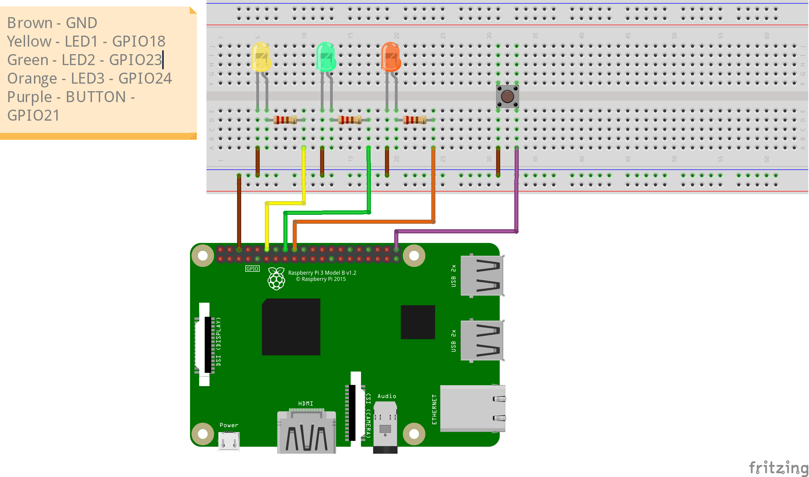

# Raspberry Pi Mini-CTF Challenge

This project is a multi-stage Capture The Flag (CTF) challenge designed for a Raspberry Pi. It involves web exploitation, brute-forcing, script automation, and basic OSINT.

## Features

*   **3 Stages:**
    1.  **Brute Force:** Crack a random top-10 password to gain initial access.
    2.  **DDoS Simulation:** Automate requests to "overload" the system (1000 clicks required).
    3.  **OSINT:** Find the specific credentials based on a hint about the Dean and his dog.
*   **LED Feedback:**
    *   3 LEDs represent the security layers.
    *   **Initial State:** All LEDs ON.
    *   **Success State:** As each task is solved, the corresponding LED turns OFF.
*   **Web Interface:** Clean, responsive UI for each stage.

## Hardware Setup

You will need:
*   Raspberry Pi (3 or 4 recommended)
*   3 LEDs (Red, Yellow, Green recommended)
*   3 Resistors (220Ω - 330Ω)
*   Jumper wires and Breadboard

**Wiring:**

| Component | RPi GPIO Pin (BCM) | Physical Pin | Description |
| :--- | :--- | :--- | :--- |
| **LED 1** | GPIO 18 | Pin 12 | Task 1 Indicator |
| **LED 2** | GPIO 23 | Pin 16 | Task 2 Indicator |
| **LED 3** | GPIO 24 | Pin 18 | Task 3 Indicator |
| **Reset Button** | GPIO 21 | Pin 40 | Reverts CTF to start |
| **GND** | GND | Pin 6/9/14/etc. | Common Ground for all LEDs & Button |

*   **LEDs:** Connect the positive (longer) leg to the GPIO pin and the negative (shorter) leg to GND via a resistor.
*   **Button:** Connect one leg of the button to **GPIO 21 (Pin 40)** and the other leg to **GND**. No extra resistor needed (internal pull-up used).



## Software Installation

1.  **Update System:**
    ```bash
    sudo apt update
    sudo apt upgrade
    ```

2.  **Install Python 3 and venv:**
    Raspberry Pi OS usually comes with Python 3. Install `venv` and `dev` (required for compiling RPi.GPIO):
    ```bash
    sudo apt install python3-venv python3-dev python3-pip
    ```

3.  **Clone/Copy Files:**
    Copy the project files to a folder on your Pi (e.g., `~/ctf_challenge`).

4.  **Create Virtual Environment:**
    Navigate to the project folder and run:
    ```bash
    python3 -m venv venv
    ```

5.  **Activate Environment:**
    ```bash
    source venv/bin/activate
    ```

6.  **Install Dependencies:**
    ```bash
    pip install -r requirements.txt
    ```

## Running the Server

1.  **Start the Server:**
    Ensure you are in the virtual environment (`(venv)` should appear in your terminal prompt) and run:
    ```bash
    python server.py
    ```
    The server will start on port `5000`.

2.  **Access the Challenge:**
    Open a browser on any device in the same network and go to:
    `http://<RASPBERRY_PI_IP>:5000`

## Solving the Challenges

### Task 1: Brute Force
*   **Goal:** Login to the system.
*   **Method:** The password is one of the top 10 most common passwords. It is selected randomly each time the server starts.
*   **Action:** Write a script or guess manualy.
*   **Success:** LED 1 turns OFF.

### Task 2: Data Flood
*   **Goal:** Retrieve "Data" 1000 times.
*   **Method:** Clicking the button manually is too slow.
*   **Action:** Write a script or use console commands to send POST requests to `/api/click`.
*   **Success:** LED 2 turns OFF.

### Task 3: Admin Access (OSINT)
*   **Goal:** Login as the Administrator.
*   **Hint:** "Dean of the faculty (Andrei). Password is Dog name + Birthyear."
*   **Solution (Default):**
    *   User: `andrei`
    *   Password: `bary1985` (This can be customized in `server.py`)
*   **Success:** LED 3 turns OFF.

## Reset the software or press the **Reset Button** to generate a new password and turn all LEDs back ON.

## Advanced Configuration

### 1. Custom Domain Name (e.g., `alatooctf.local`)

Instead of typing an IP address (like `192.168.1.5`), you can access the server using a friendly name.

1.  **Install Avahi Daemon (mDNS):**
    On the Raspberry Pi, run:
    ```bash
    sudo apt install avahi-daemon
    ```

2.  **Change Hostname (Optional):**
    If your Pi's hostname is `raspberrypi`, the default address will be `raspberrypi.local`. To change it to `alatooctf`:
    ```bash
    sudo hostnamectl set-hostname alatooctf
    ```
    Then edit `/etc/hosts`:
    ```bash
    sudo nano /etc/hosts
    ```
    Replace `raspberrypi` with `alatooctf` in the last line (typically `127.0.1.1`).
    Reboot the Pi: `sudo reboot`.

3.  **Access:**
    You can now access the site at: `http://alatooctf.local:5000`
    *(Note: This works on iPhones, Macs, and Windows 10/11 automatically. Android devices may require a specific browser setting or update).*

### 2. Auto-Run on Boot (Production Server)

To ensure the server starts automatically when the Pi turns on, we'll use `gunicorn` (a production server) and `systemd`.

1.  **Install Gunicorn:**
    Running `pip install -r requirements.txt` should have installed it. If not:
    ```bash
    pip install gunicorn
    ```

2.  **Create Service File:**
    Create a new systemd service file:
    ```bash
    sudo nano /etc/systemd/system/ctf-server.service
    ```

3.  **Add Configuration:**
    Paste the following into the file. **IMPORTANT:** Change `/home/pi/ctf_challenge` to your actual project path.

    ```ini
    [Unit]
    Description=Gunicorn instance to serve CTF Challenge
    After=network.target

    [Service]
    User=pi
    Group=www-data
    WorkingDirectory=/home/pi/ctf_challenge
    Environment="PATH=/home/pi/ctf_challenge/venv/bin"
    ExecStart=/home/pi/ctf_challenge/venv/bin/gunicorn --workers 3 --bind 0.0.0.0:5000 server:app

    [Install]
    WantedBy=multi-user.target
    ```

4.  **Start and Enable:**
    ```bash
    sudo systemctl start ctf-server
    sudo systemctl enable ctf-server
    ```

5.  **Check Status:**
    ```bash
    sudo systemctl status ctf-server
    ```

### 3. Mobile Friendly
The web interface is now responsive! You can easily play the CTF from your smartphone connected to the same Wi-Fi network.
